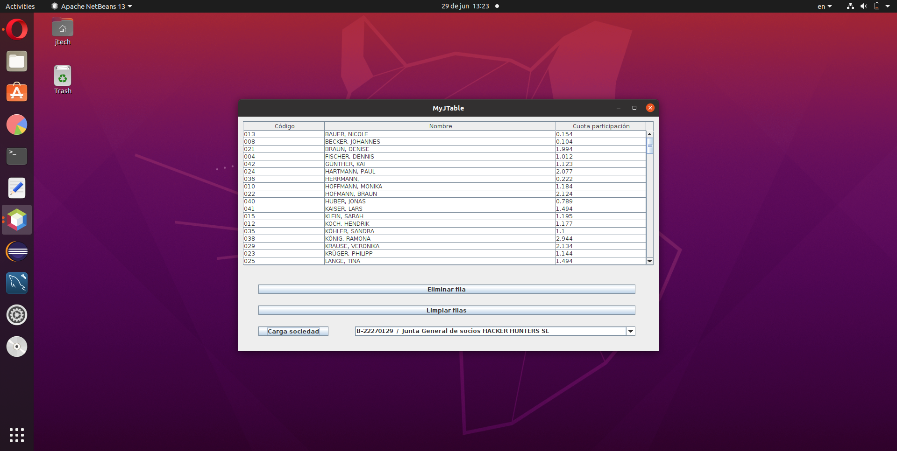

# MyJTable :coffee:
Proyecto Java SE con arquitectura de tres capas (three-tier) para ejemplificar el funcionamiento de la clase JTable de Swing como componente central en el diseño de interfaces administrativas. 

***JTable oracle documentation*** ***[link](https://docs.oracle.com/javase/7/docs/api/javax/swing/JTable.html)***.

